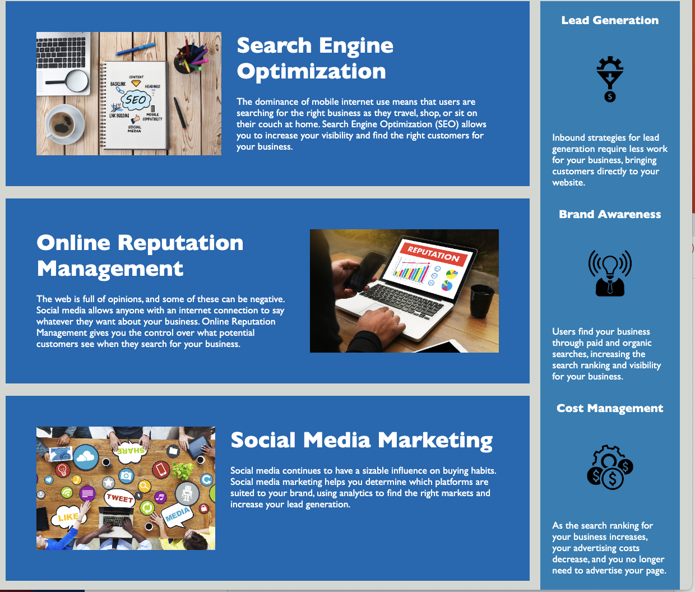

# horiseon-refactor-accesability

---

## Description
Refactored an existing website to improve accessibility issues, code optimization and SEO. 

-The old code did not use semantic element naming. Division elements replaced with header, footer, article and aside elements.

-there was significant duplication of css code with multiple class names having the same code. This was consolidated by eliminating the classes and using the elements article and aside which each had common css

- Changed a class name to background-image and added aria-label for accessabilty to main image at top

- added alt attributes to multiple images for accessability

## Usage
The 3 main products of Horiseon Social Solution Services are Search Engine Optimization, Online Reputation Management and Social Media Marketing as explained on the website home page seen on this screenshot

```md

```

##Credits
The original website provided by the excellent staff at UC Berkeley Extension Full Stack Bootcamp